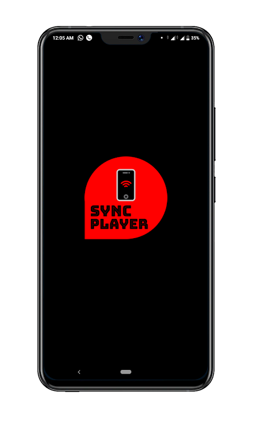
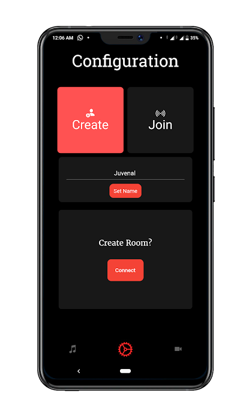
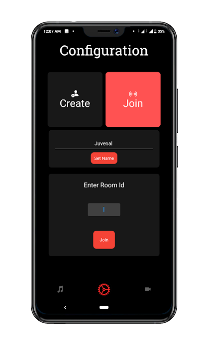
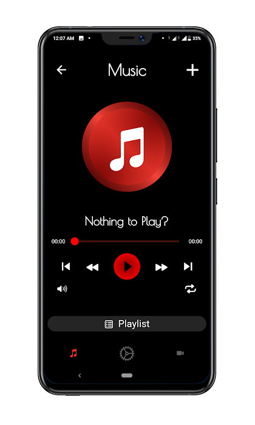
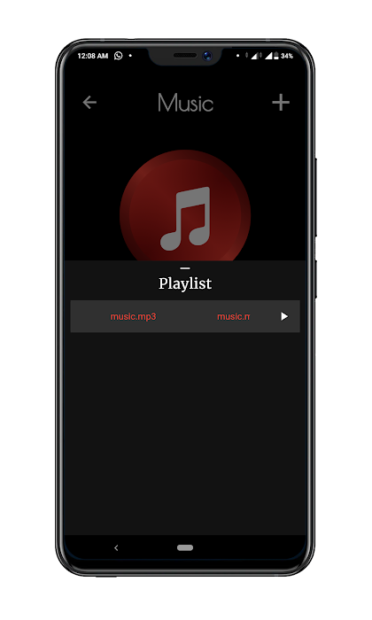
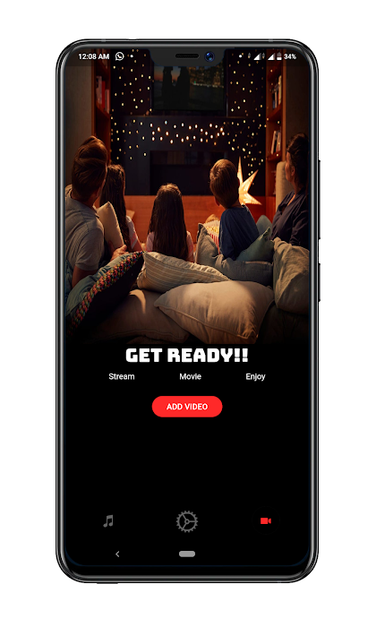
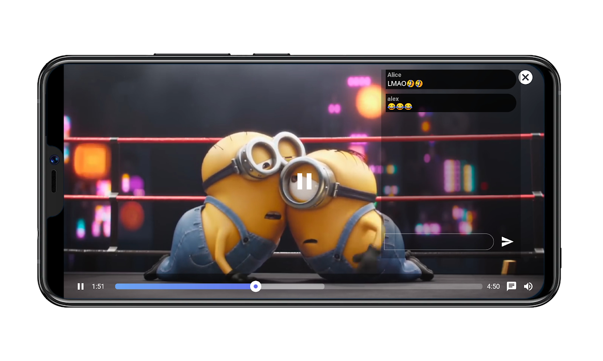

# Sync Player

Sync Player in Flutter

## Getting Started

Sync Player is a multimedia app which allow user to create and join private room where members can play their media at sync with each other. User can also chat with other while playing videos.
This project contains some extra functionality as normal multimedia app does not provide.  

## APK

` `

### Show some :heart: and star the repository to support the project

For more contact me @[Gmail](mailto::yogeshk4124@gmail.com),

### I :heart: Flutter

 

# Screenshots

 

# Backend

Syncplayer is a multi platform app. That is why we built API endpoints to connect all those platforms to backend servers for cross-platform communication.

SyncPlayer backend comprises of:

1. SyncPlayer Web:
   A. Website for using syncplayer in internet browser and without any installations.
   B. Contains all the same functionality as of mobile apps.
   C. Light, faster and more portable in usage.
   Link: http://harmonpreet012.centralindia.cloudapp.azure.com:8000/player

2. SyncPlayer API: API endpoints build for syncplayer functions.
   Link: http://harmonpreet012.centralindia.cloudapp.azure.com:8000/

3. Messaging API: API endpointsfor handling chat messages.
   Link: http://harmonpreet012.centralindia.cloudapp.azure.com:8001

Detailed documentations are available on respective links.

For reporting any bugs, write us in issues sections.
New feature and ideas are always welcomed.  

# Pull Requests

I welcome and encourage all pull requests. Here are some basic rules to follow to ensure timely addition of your request:

1. Match coding style (braces, spacing, etc.) This is best achieved using `Reformat Code` feature of Android Studio `CMD`+`Option`+`L` on Mac and `CTRL` + `ALT` + `L` on Linux + Windows .
2. If its a feature, bug fix, or anything please only change code to what you specify.
3. Please keep PR titles easy to read and descriptive of changes, this will make them easier to merge :)
4. Pull requests _must_ be made against `develop` branch. Any other branch (unless specified by the maintainers) will get rejected.
5. Check for existing [issues](https://github.com/Yogeshk4124/SyncPlayer/issues) first, before filing an issue.
6. Make sure you follow the set standard as all other projects in this repo do
7. Have fun! 

# 👍 Contribution

1. Fork it
2. Create your feature branch (git checkout -b my-new-feature)
3. Commit your changes (git commit -m 'Add some feature')
4. Push to the branch (git push origin my-new-feature)
5. Create new Pull Request 

## Created By

### Yogesh Kumar(Flutter)

[Github](https://github.com/Yogeshk4124) 
[Linkedin](https://www.linkedin.com/in/yogeshk4124/)

### Harmonpreet Singh(Backend)

[Github](https://github.com/Yogeshk4124) 
[Linkedin](https://www.linkedin.com/in/yogeshk4124/)

### iOS implementation

This project is not implemented on ios yet. Because I own Windows 10 PC. 

### Android implementation

This Project is implemented in `android` `9.0` and `8.0` in `Asus Zenfone Max Pro M2` and `Realme 5S (64/4GB)`. 

## Facing Any Problem or need any Help?

Write me in [issues](https://github.com/Yogeshk4124/SyncPlayer/issues) section. 

### Keep Fluttering
